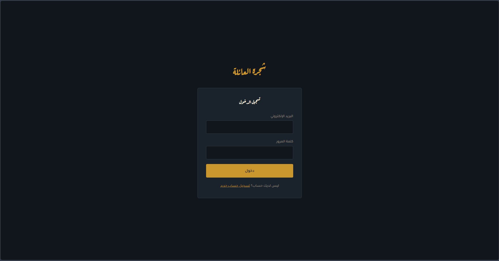
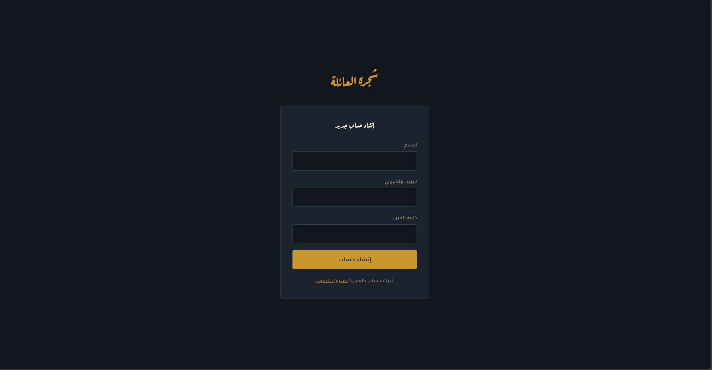
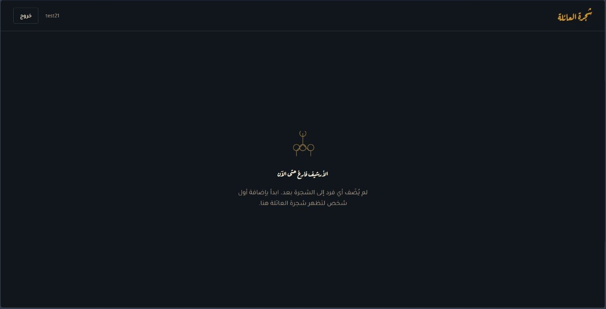

# شجرة العائلة — Family Tree Backend

REST API سيرفرلس (Serverless-style) لتطبيق شجرة العائلة، مبني بـ **FastAPI** و**PostgreSQL**، شغال فعليًا على **AWS** (EC2 + RDS + S3 + CloudFront). المشروع بيدعم علاقات عائلية معقدة (زواج تاني، تبني، أكتر من أب/أم) عن طريق استعلامات PostgreSQL التكرارية (Recursive CTEs)، مع مصادقة JWT وصلاحيات مبنية على الأدوار (Viewer / Admin).

**🔗 الموقع شغال فعليًا:** [https://d3moyfpvj6r1i2.cloudfront.net/]

---

## لقطات من الموقع

<p align="center">
  
  
</p>
<p align="center">
  
</p>

---

## المعمارية الكاملة

كل تفاصيل تصميم البنية التحتية، وليه اتخدت كل قرار، وخطوات النشر القابلة لإعادة التنفيذ، موثقة بالكامل في [`ARCHITECTURE.md`](./ARCHITECTURE.md).

مخطط المعمارية (قابل للتعديل مباشرة على [app.diagrams.net](https://app.diagrams.net)): [`family-tree-architecture.drawio`](./family-tree-architecture.drawio)

## Tech Stack

| الطبقة | التقنية |
|---|---|
| Backend | FastAPI (Python), SQLAlchemy (async), Alembic |
| Database | PostgreSQL على Amazon RDS |
| Auth | JWT (access/refresh tokens) + Role-Based Access Control |
| Storage | Amazon S3 (presigned URLs للصور/المستندات) |
| Infrastructure | Amazon EC2 · Nginx (reverse proxy) · Gunicorn/Uvicorn · systemd |
| Frontend (ريبو منفصل) | React + TypeScript + Vite، مستضاف على S3 + CloudFront |

## أهم اللي اتعلمته من المشروع ده

- نشر backend حقيقي على سيرفر Linux (EC2) بأدوات إنتاج فعلية (systemd, Nginx) مش مجرد تشغيل محلي
- تصميم عزل شبكي بين الخدمات باستخدام AWS Security Groups (قاعدة البيانات معزولة تمامًا عن الإنترنت، متاحة بس للـ backend)
- نمذجة علاقات عائلية حقيقية (مش شجرة هرمية بسيطة) باستخدام جدول علاقات (edges) واستعلامات PostgreSQL التكرارية
- تتبّع وإصلاح مشاكل بيئة حقيقية في الإنتاج: توافق نسخ المكتبات (`asyncpg`, `bcrypt`), أخطاء الـ CORS/CloudFront caching, تناسق الـ schemas بين الـ API والـ database

## هيكل المشروع

```
app/
├── core/         # الإعدادات، JWT، RBAC
├── db/           # الاتصال بقاعدة البيانات
├── models/       # جداول SQLAlchemy
├── schemas/      # Pydantic request/response
├── api/v1/       # الـ routes (auth, persons, relationships, tree, media)
└── services/     # منطق العمل (tree_service فيها الـ recursive CTEs)
alembic/          # database migrations
```

## التشغيل محليًا

```bash
python -m venv venv
source venv/bin/activate   # على Windows: venv\Scripts\Activate.ps1
pip install -r requirements-dev.txt

cp .env.example .env   # عدّل DATABASE_URL و JWT_SECRET_KEY

alembic upgrade head
uvicorn app.main:app --reload
```

الـ API docs التفاعلية (Swagger) هتلاقيها على `http://localhost:8000/docs`.

## الترخيص

MIT
